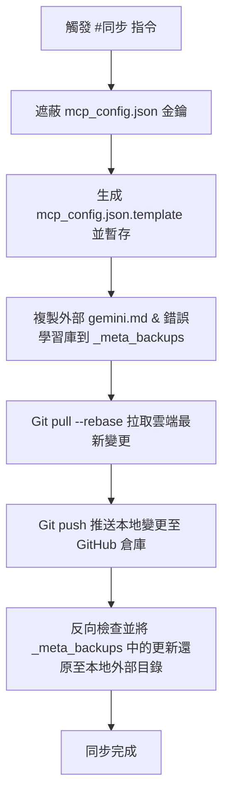

# Antigravity Settings and Skills (v1.4.0)

> **Google Antigravity AI 代理的全域自訂設定與技能工作流備份倉庫**

本倉庫專為備份、同步與跨電腦復原 Google Antigravity AI 代理的**全域開發環境設定**與**自訂技能 (Global Skills)** 所設計。透過將版控根目錄擴大至整個 `.gemini/config`，我們得以下載與還原權限、外掛模組、技能與外部學習知識。

---

## 📖 專案簡介 (Overview)

在與 AI 進行程式設計或自動化 Swarm 協作時，AI 需要與本地特定系統相匹配的私有化工具、授權以及開發 SOP 指引。

本專案將全域的開發配置進行集中管理與版本控制。它能解決：
1. **設定遷移難題**：新電腦不需要重新授權或重設外掛與權限。
2. **Token 與上下文優化**：透過集中管理自訂技能，有效降低對話時的上下文 (Context) 負載。
3. **持續性學習**：將 AI 代理在對話中學到的錯誤教訓，透過腳本同步至雲端，實現跨對話「越用越聰明」的目標。

---

## ✨ 核心功能 (Key Features)

* **⚙️ 全域權限與外掛配置**：統一控制 `config.json` 權限以及 `plugins/` 載入的外掛，實現跨裝置一鍵同步。
* **🔒 安全金鑰遮蔽**：內建自動遮蔽腳本。同步時自動將 `mcp_config.json` 內敏感的 `GITHUB_PERSONAL_ACCESS_TOKEN` 及本機使用者絕對路徑轉為 `YOUR_...` 佔位符，並輸出為安全模板進行版控。
* **🚫 本機特定路徑排除**：透過 `.gitignore` 排除本機特定專案的 UUID 設定 (`projects/`)，避免覆蓋時發生路徑混淆或系統異常。
* **🧠 外部知識庫雙向同步**：自動在背景同步外層的 `gemini.md` (全域 Prompt) 及 `hoonsor-error-learning` 錯誤學習庫，拉取更新後自動反向還原覆蓋。
* **⚡ 一鍵自動化同步**：當您在對話中輸入「**#同步**」時，AI 會自動執行備份並安全推送到遠端倉庫。

---

## 📁 專案目錄結構 (Project Directory Structure)

本倉庫備份並管理了以下資料夾與檔案結構：

```text
C:\Users\<username>\.gemini\config\ (本倉庫根目錄)
 ├── _meta_backups/               # 同步腳本自動打包的外部全域設定檔案
 │    ├── gemini.md               # 外部全域 System Prompt 與指示
 │    └── hoonsor-error-learning/ # 自動化錯誤學習知識庫（防範重複犯錯）
 ├── plugins/                     # 載入的擴充外掛套件定義
 │    ├── android-cli-plugin/     # Android 開發 CLI 工具外掛
 │    ├── chrome-devtools-plugin/ # Chrome DevTools 自動化外掛
 │    ├── firebase/               # Firebase 連接外掛
 │    └── google-antigravity-sdk/ # Google Antigravity SDK 外掛核心
 ├── skills/                      # AI 代理可動態調用的全域自訂技能
 │    ├── 00-install-all/         # 一次安裝全部懶人包技能
 │    ├── 01-notebooklm/          # NotebookLM MCP 連接技能
 │    ├── 02-github/              # GitHub CLI 連接與設定技能
 │    ├── hoonsor-sync-global-skills/ # 本同步模組的核心技能與腳本
 │    │    ├── SKILL.md           # 技能觸發指引（引導 AI 跑 sync.ps1）
 │    │    └── sync.ps1           # 自動遮蔽、備份與 Git 推送的 PowerShell 腳本
 │    └── ...                     # 其他約 60 個高頻次核心技能
 ├── config.json                  # 全域權限許可與功能設定 (如 globalPermissionGrants)
 ├── mcp_config.json.template     # 已自動遮蔽敏感金鑰之 MCP 伺服器設定模板 (版控追蹤)
 ├── .gitignore                   # 排除敏感與本機專用路徑 (如 projects/)
 ├── PROJECT_STATUS.md            # 本專案的進度與狀態追蹤 (包含 SemVer 版本號)
 └── README.md                    # 本倉庫的使用與還原說明文件 (本檔案)
```

---

## 🔄 備份與同步機制 (Sync Workflow)

本專案使用 `sync.ps1` 自動化處理備份與推送，其執行步驟如下：



### 自動排除規則 (.gitignore)
為了相容性與安全性，以下檔案已配置於 `.gitignore` 中進行忽略：
- `mcp_config.json`：包含您個人的 API Token 密鑰。
- `projects/`：包含本地專案特定的實體絕對路徑 (例如 `d:\01-Project\...`)。
- `.migrated`：本機環境遷移標記。
- `*.log`：執行過程產生的暫存日誌。

---

## 🚀 新電腦環境復原指南 (Restore Guide)

當您要將這些設定與技能同步到一台全新的電腦上時，請依序執行以下步驟：

### Step 1: 複製倉庫至設定路徑
開啟 PowerShell，將此倉庫複製到您新電腦的 `.gemini\config` 目錄下：
```powershell
git clone https://github.com/hoonsor/Antigravity-Setting-and-Skills.git "$HOME\.gemini\config"
```

### Step 2: 建立本地 MCP 設定
複製模板檔案以生成真實的本地 `mcp_config.json`：
```powershell
Copy-Item "$HOME\.gemini\config\mcp_config.json.template" "$HOME\.gemini\config\mcp_config.json"
```

### Step 3: 配置個人私鑰與路徑
使用編輯器打開 `$HOME\.gemini\config\mcp_config.json`，並更新以下屬性：
1. **GitHub MCP Server 金鑰**：
   在 `github-mcp-server` -> `env` -> `GITHUB_PERSONAL_ACCESS_TOKEN` 處填入您個人的 **GitHub Personal Access Token** (形式如 `ghp_...`)。
2. **Google Drive MCP Server 本機路徑**：
   在 `gdrive` -> `env` 的 `GDRIVE_OAUTH_PATH` 與 `GDRIVE_CREDENTIALS_PATH` 處，將路徑中的使用者名稱修改為您新電腦的 Windows 使用者名稱。

### Step 4: 還原外部 Prompt 與知識庫
首次執行同步腳本，它會自動將備份的 `gemini.md` 和錯誤學習庫釋放並還原回新電腦的本地外層目錄：
```powershell
powershell -ExecutionPolicy Bypass -File "$HOME\.gemini\config\skills\hoonsor-sync-global-skills\sync.ps1"
```

> [!TIP]
> 執行此腳本後，新電腦上的 AI 代理就已完全裝載了您所有的全域自訂技能與設定，並與雲端保持最新連接！

---
*Generated and maintained by Google Antigravity Architect*
