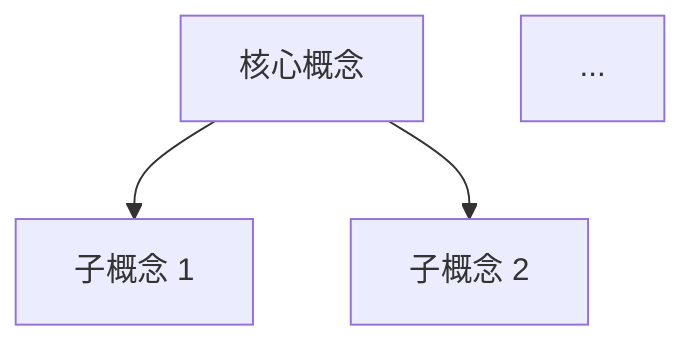

# 📝 #筆記 — 對話主題筆記生成器

> **核心理念**：將對話中的知識結晶，精煉為一份高品質的 Obsidian 筆記，方便日後查閱與複習。

---

## 🎯 觸發條件

當使用者輸入包含以下關鍵詞時觸發：
- `#筆記 <主題說明>`
- 「幫我做筆記」、「記錄這個主題」

> [!CAUTION]
> **絕對禁止在使用者未指定主題的情況下自行生成筆記。**
> 若使用者只輸入 `#筆記` 而沒有附上主題，**必須立刻停下來詢問**：
> 「*請問您希望針對本次對話中的哪個主題製作筆記？請簡要描述主題方向。*」
> 此規則的目的是避免浪費 tokens 和產出使用者不需要的資料。

---

## 🚀 執行流程

### Phase 1：主題確認與意圖解析

1. **解析使用者指令**：從 `#筆記` 後方的文字提取主題關鍵詞。
   - 範例輸入：`#筆記 建立supabase的專案並取得DIRECT_URL`
   - 解析結果：主題 = 「建立 Supabase 專案並取得 DIRECT_URL」
2. **若主題不明確**：立即向使用者提問確認，**絕不自行猜測**。

### Phase 2：對話內容搜尋與篩選

1. **讀取當前對話紀錄**：
   - 路徑：`<appDataDir>\brain\<conversation-id>\.system_generated\logs\transcript.jsonl`
   - 若對話過長，使用 `grep_search` 搭配主題關鍵詞定位相關段落。
2. **收集相關素材**：
   - 🔍 提取與主題直接相關的所有對話內容（使用者提問 + AI 回覆）
   - 🖼️ **特別注意使用者附上的圖片**：若對話中使用者上傳了截圖，且圖片內容與主題相關，必須在筆記中引用並描述圖片中的關鍵資訊（如介面操作步驟、設定畫面等）
   - ⚠️ **資訊正確性校驗**：若對話過程中發現某些資訊已過時（例如 AI 一開始提供的舊介面路徑，但使用者截圖後顯示已有新介面），**必須以對話中最終確認的正確資訊為準**，不可將過時錯誤資訊寫入筆記

### Phase 3：筆記生成

使用以下模板結構生成筆記：

```markdown
---
title: <主題簡短標題>
date: <YYYY-MM-DD>
tags: [Antigravity對話筆記, <相關技術標籤>]
category: 對話筆記
source: Antigravity Session
---

# <主題標題>

> [!info] 筆記摘要
> <用 2-3 句話概述本筆記的核心內容與價值>

## 🧠 概念總覽（心智圖）

（使用 Mermaid flowchart 呈現本主題的核心概念架構、流程或關係）



## 📋 重點整理

（使用表格整理關鍵資訊，加速掃讀）

| 項目 | 說明 |
|------|------|
| ... | ... |

## 🔧 操作步驟 / 詳細說明

（依主題性質，使用有序清單、程式碼區塊等詳細展開）

### 步驟 1：...
...

### 步驟 2：...
...

## ⚠️ 注意事項與踩坑記錄

（記錄對話中發現的錯誤、踩坑、以及最終的正確解法）

## 📎 參考連結

- [相關文件或網址](URL)
```

#### 筆記生成原則

1. **心智圖 (Mermaid) 必備**：每份筆記至少包含一張心智圖或流程圖，用以呈現主題的整體架構或操作流程
2. **表格加速掃讀**：關鍵參數、比較項目、設定值等，優先使用表格呈現
3. **程式碼區塊保留**：對話中出現的指令、程式碼片段，完整保留並標註語言
4. **Obsidian 語法**：使用 Obsidian 支援的 Callout 語法（`> [!info]`、`> [!warning]`、`> [!tip]` 等）
5. **繁體中文撰寫**：全文使用繁體中文（技術名詞維持英文）
6. **資訊正確性**：以對話中**最終確認的正確資訊**為準，過時或被推翻的資訊不可寫入

### Phase 4：檔案儲存與回報

1. **檔案命名規則**：`YYYYMMDD-<主題簡短英文描述>.md`
   - 範例：`20260918-Supabase_Project_Setup_DIRECT_URL.md`
2. **儲存路徑**：`D:\Obsidian\Hoonsor\●AI生成筆記\`
3. **使用 `write_to_file` 建立檔案**
4. **回報使用者**：
   - 提供完整的檔案連結（使用 `file:///` 格式，可直接點擊開啟）
   - 簡要列出筆記的章節大綱
   - 提醒使用者可在 Obsidian 中開啟檢視

---

## ⚙️ 配置常量

```yaml
# Obsidian Vault 路徑
OBSIDIAN_VAULT: D:\Obsidian\Hoonsor
NOTE_OUTPUT_DIR: D:\Obsidian\Hoonsor\●AI生成筆記

# 檔案命名
FILENAME_FORMAT: "YYYYMMDD-<Topic_English>.md"
FILENAME_DATE_FORMAT: "YYYYMMDD"

# YAML Frontmatter 預設
DEFAULT_TAGS: [Antigravity對話筆記]
DEFAULT_CATEGORY: 對話筆記
DEFAULT_SOURCE: Antigravity Session
```

---

## 🚫 反模式警告

> [!CAUTION]
> **在執行本技能時，絕對不要：**
> 1. **在使用者未指定主題時自行生成** — 這是本技能的最高禁令
> 2. **將對話中已被推翻的過時資訊寫入筆記** — 必須以最終確認的正確版本為準
> 3. **忽略使用者附上的圖片內容** — 圖片中的介面截圖往往包含最新的正確操作路徑
> 4. **省略心智圖或表格** — 這是本技能的核心價值，用以加速使用者理解
> 5. **使用簡體中文** — 全文必須使用繁體中文
> 6. **產出流水帳式的對話記錄** — 筆記應是精煉過的知識結晶，不是對話逐字稿
